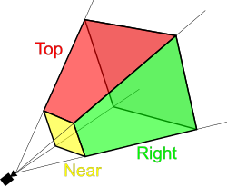

M — Model. Where is this specific object in the world? Its position, rotation, scale.
V — View. Where is the camera? What direction is it looking?
P — Projection. How does 3D space get flattened onto a 2D screen? Perspective, field of view, near/far planes.

Every vertex goes through all three transforms in sequence: object space → world space → camera space → screen space.

The convention for Flux will be forward is +Z, right is +X, up is +Y. As yaw increases from 0, the camera rotates to the right (+X direction). At yaw = 0 you're looking down +Z. At yaw = 90 degrees you're looking down +X.

Now we can imagine the direction vector as a point in a sphere around the camera with a unit vector magnitude of 1 since we only care about the direction. Using yaw and pitch we can point the direction vector of the camera to whatever position we want. To determine the x,y, and z components of that point we use the formula.
Since looking straight is +z and looking right is +x, we want yaw = 90 to be x = 1 and z = 0. So:
x = sin(yaw) * cos(pitch)
We multiply by the cos of pitch since the more we look up or down, the more x and z decrease. 

For y we only need the sin(pitch) since if we are looking straight up or down, y is 1 and x and z are 0.
y = sin(pitch)

Finally for z looking straight forward should be z = 1 when yaw = 0. Once again we need to multiply by the cos of pitch.
z = cos(yaw) * cos(pitch)

## NDC 

NDC stands for Normalized Device Coordinates. It's the coordinate system that exists after the projection matrix runs, after the direction vector and vertex positions have been transformed through the full MVP pipeline.

After the projection matrix runs, every visible vertex needs to end up in a standard box, a cube of coordinates that the GPU knows maps exactly to the screen. That box is NDC.
In NDC, the screen center is always (0, 0), the edges are always -1 to +1 in X and Y. Everything inside that box gets rendered, everything outside gets clipped.

Vulkan's Y axis is flipped compared to OpenGL. In Vulkan, Y = -1 is the top of the screen and Y = +1 is the bottom. For Z, Vulkan uses 0 to 1 instead of OpenGL's -1 to 1. More precision for depth values since the full range maps to the visible frustum.

A view frustum:

X: -1 (left) to +1 (right)
Y: -1 (top) to +1 (bottom) — flipped
Z: 0 (near) to 1 (far)

Objects close to the camera need precise depth values to avoid z-fighting, two surfaces at nearly the same depth flickering. Objects far away are small on screen and a few units of imprecision doesn't matter visually.

This non-linear mapping is a consequence of how perspective projection works mathematically, it falls out naturally from the math, it's not a deliberate choice.

## Gribb-Hartmann method

Left plane: row4 + row1
Right plane: row4 - row1
Bottom plane: row4 + row2
Top plane: row4 - row2
Near plane: row4 + row3 (Vulkan depth is 0 to 1, not -1 to 1)
Far plane: row4 - row3

